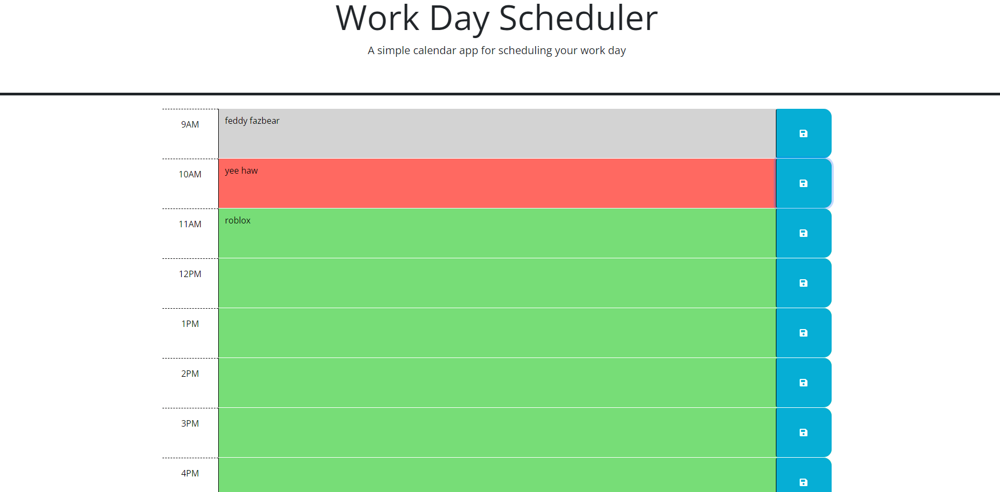

# Pokemon Quiz

## Description

- My motivation for this project was to create a task scheduler to keep track of responsibilities that accurately represents the time block by hour.
- I built this project to further utilize knowledge of JQuery and Day.js in a way that can be useful for every day life.
- This code is effective in keeping plans and tasks organized while showing each hour by color- past, present, and future.
- Composing this task scheduler, I learned how to effectivelt utilize Day.js and understand a Javascrip framework I was unfamiliar with.

## Github & Deployed Site
- [Github Repository](https://github.com/Celyph/task-scheduler)
- [Deployed Site](https://celyph.github.io/task-scheduler/)

## Usage

## Credits

I used the ReadMe guide from [https://coding-boot-camp.github.io/full-stack/github/professional-readme-guide](https://coding-boot-camp.github.io/full-stack/github/professional-readme-guide).